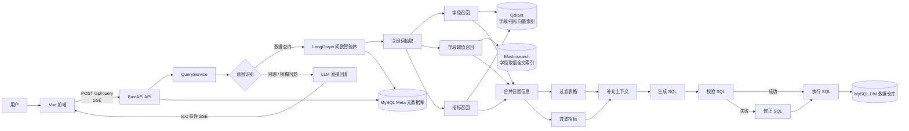
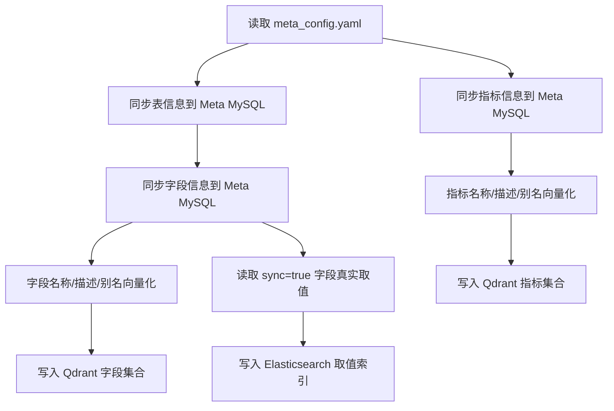

# 掌柜问数 Data Agent

> 面向数据仓库场景的自然语言问数系统。用户通过自然语言提出业务问题，系统自动完成元数据召回、SQL 生成、SQL 校验、SQL 执行和结果流式返回。

## 目录

- [项目简介](#项目简介)
- [核心能力](#核心能力)
- [系统架构](#系统架构)
- [技术栈](#技术栈)
- [仓库结构](#仓库结构)
- [环境要求](#环境要求)
- [快速开始](#快速开始)
- [配置说明](#配置说明)
- [元数据知识库构建](#元数据知识库构建)
- [问数智能体工作流](#问数智能体工作流)
- [API 文档](#api-文档)
- [前端说明](#前端说明)
- [日志与可观测性](#日志与可观测性)
- [安全与生产化建议](#安全与生产化建议)
- [常见问题](#常见问题)
- [路线图](#路线图)

## 项目简介

**掌柜问数 Data Agent** 是一个基于大模型、LangGraph、向量检索和全文检索的数据分析智能体项目，目标是在数据仓库场景中提供自然语言到 SQL 的自动分析能力。

系统以数据仓库元数据为核心，将表、字段、指标、字段取值等信息统一沉淀到元数据知识库中。用户发起自然语言查询后，系统通过多路召回定位相关字段、指标和字段取值，再由大模型生成 SQL，经过校验与修正后执行查询，并通过 SSE 将执行进度和结果实时返回给前端。

典型问题示例：

```text
统计去年各地区的销售总额
查询华东地区各商品品类的 GMV
统计不同会员等级的平均订单金额
```

## 核心能力

| 能力 | 说明 |
|---|---|
| 自然语言问数 | 用户无需编写 SQL，直接使用中文业务问题查询数据 |
| 意图识别与路由 | 识别用户输入意图（数据查询 / 闲聊 / 模糊问题），闲聊和模糊问题直接由 LLM 回复，只有数据查询走完整问数工作流 |
| 元数据知识库 | 使用 MySQL 维护表、字段、指标及字段和指标关系 |
| 语义召回 | 使用 Qdrant 存储字段和指标向量，支持语义相似度检索 |
| 全文召回 | 使用 Elasticsearch 召回字段真实取值，提升 WHERE 条件准确性 |
| Agent 工作流 | 使用 LangGraph 编排关键词抽取、召回、过滤、SQL 生成、校验、修正、执行等节点 |
| SQL 自动校验 | 通过 `EXPLAIN` 预校验 SQL，失败后进入修正节点 |
| 流式响应 | 基于 SSE 实时返回节点进度、查询结果和错误信息 |
| 前后端分离 | 后端 FastAPI，前端 Vue 3 + Vite |
| 请求级日志追踪 | 使用 `request_id` 关联单次请求链路日志 |

## 系统架构



## 技术栈

### 后端

| 分类 | 技术 |
|---|---|
| Web 框架 | FastAPI |
| Agent 编排 | LangGraph |
| LLM 编排 | LangChain |
| ORM / DB | SQLAlchemy 2.x Async + asyncmy |
| 元数据存储 | MySQL |
| 数据仓库模拟 | MySQL DW 库 |
| 向量数据库 | Qdrant |
| 全文检索 | Elasticsearch 8.x |
| Embedding 服务 | Text Embedding Inference / HuggingFaceEndpointEmbeddings |
| 中文分词 | jieba |
| 配置管理 | OmegaConf + YAML |
| 日志 | loguru |
| 包管理 | uv |

### 前端

| 分类 | 技术 |
|---|---|
| 框架 | Vue 3 |
| 构建工具 | Vite |
| 接口通信 | Fetch + ReadableStream |
| 响应协议 | Server-Sent Events 风格流式数据 |

## 仓库结构

当前项目由后端工程和前端工程组成：

```text
data-agent/
├── app/
│   ├── agent/                 # LangGraph 智能体工作流
│   │   ├── graph.py           # 图定义
│   │   ├── state.py           # 状态定义
│   │   ├── context.py         # 运行时依赖上下文
│   │   ├── llm.py             # 大模型初始化
│   │   └── nodes/             # 工作流节点
│   ├── api/                   # FastAPI 路由、Schema、依赖注入
│   ├── clients/               # MySQL / Qdrant / ES / Embedding 客户端管理
│   ├── conf/                  # 配置结构定义与加载逻辑
│   ├── core/                  # 日志、生命周期、上下文变量
│   ├── entities/              # 业务实体
│   ├── models/                # SQLAlchemy ORM Model
│   ├── prompt/                # Prompt 加载工具
│   ├── repositories/          # MySQL / Qdrant / ES 数据访问层
│   ├── scripts/               # 初始化脚本
│   └── services/              # 业务服务
│       ├── intent_classifier.py  # 意图识别（数据查询 / 闲聊 / 模糊问题）
│       ├── meta_knowledge_service.py  # 元数据知识库构建
│       └── query_service.py      # 查询服务与意图路由
├── conf/
│   ├── app_config.yaml        # 应用配置
│   └── meta_config.yaml       # 元数据同步配置
├── prompts/                   # Prompt 模板
├── main.py                    # FastAPI 入口
├── pyproject.toml             # Python 项目配置
└── uv.lock                    # uv 锁文件
```

```text
data-agent-fronted/
├── src/
│   ├── App.vue                # 问数聊天页
│   ├── main.js                # Vue 入口
│   └── style.css              # 全局样式
├── vite.config.js             # Vite 配置，包含 /api 代理
├── package.json
└── index.html
```

> 说明：当前上传的后端压缩包中未包含 `docker-compose.yaml`、数据库初始化 SQL 或 Elasticsearch IK 分词器安装脚本。README 中的服务启动部分因此采用“已有基础服务”的方式描述。若企业交付需要一键启动，建议补充 `docker-compose.yaml` 和初始化脚本。

## 环境要求

### 后端运行环境

| 组件 | 建议版本 | 说明 |
|---|---:|---|
| Python | >= 3.12 | `pyproject.toml` 要求 |
| uv | 最新稳定版 | Python 依赖与虚拟环境管理 |
| MySQL | 8.x | 元数据库 `meta` 与模拟数仓库 `dw` |
| Qdrant | 1.x | 字段和指标向量索引 |
| Elasticsearch | 8.x | 字段取值全文检索 |
| Text Embedding Inference | 兼容 BGE 输出 | 默认模型 `BAAI/bge-large-zh-v1.5`，向量维度 1024 |
| LLM 服务 | OpenAI 兼容接口 | 需提供 `api_key` 与 `base_url` |

### 前端运行环境

| 组件 | 建议版本 |
|---|---:|
| Node.js | >= 20 |
| npm | >= 10 |

## 快速开始

### 1. 克隆项目

```bash
git clone <your-repository-url>
cd data-agent
```

如果前后端是两个独立目录：

```bash
# 后端
cd data-agent

# 前端
cd ../data-agent-fronted
```

### 2. 准备基础服务

启动或确认以下服务可访问：

| 服务 | 默认地址 |
|---|---|
| MySQL | `localhost:3306` |
| Qdrant | `localhost:6333` |
| Elasticsearch | `localhost:9200` |
| Embedding 服务 | `localhost:8081` |
| LLM API | `conf/app_config.yaml` 中配置的 `base_url` |

需要提前创建 MySQL 数据库：

```sql
CREATE DATABASE IF NOT EXISTS meta DEFAULT CHARACTER SET utf8mb4 COLLATE utf8mb4_unicode_ci;
CREATE DATABASE IF NOT EXISTS dw DEFAULT CHARACTER SET utf8mb4 COLLATE utf8mb4_unicode_ci;
```

并准备：

1. `meta` 库：用于存储 `table_info`、`column_info`、`metric_info`、`column_metric` 等元数据表。
2. `dw` 库：用于模拟数据仓库，当前示例配置涉及 `dim_region`、`dim_customer`、`dim_product`、`dim_date`、`fact_order`。
3. Elasticsearch：如使用中文分词字段，建议安装并配置 IK 分词器，否则 `ik_max_word` mapping 会创建失败。

### 3. 安装后端依赖

```bash
cd data-agent
uv sync
```

如需手动安装依赖：

```bash
uv add fastapi[standard] sqlalchemy asyncmy qdrant-client "elasticsearch[async]>=8,<9" langchain langchain-huggingface langgraph jieba omegaconf pyyaml loguru cryptography
```

### 4. 修改应用配置

编辑：

```text
conf/app_config.yaml
```

重点修改以下配置：

```yaml
db_meta:
  host: localhost
  port: 3306
  user: <your-user>
  password: <your-password>
  database: meta

db_dw:
  host: localhost
  port: 3306
  user: <your-user>
  password: <your-password>
  database: dw

qdrant:
  host: localhost
  port: 6333
  embedding_size: 1024

embedding:
  host: localhost
  port: 8081
  model: BAAI/bge-large-zh-v1.5

es:
  host: localhost
  port: 9200
  index_name: data_agent

llm:
  model_name: <your-model-name>
  api_key: <your-api-key>
  base_url: <your-openai-compatible-base-url>
```

### 5. 构建元数据知识库

```bash
uv run python -m app.scripts.build_meta_knowledge -c ./conf/meta_config.yaml
```

该脚本会执行：

1. 读取 `conf/meta_config.yaml`。
2. 将表、字段、指标信息写入 MySQL `meta` 库。
3. 将字段和指标信息写入 Qdrant 向量集合。
4. 将配置为 `sync: true` 的字段取值写入 Elasticsearch。

### 6. 启动后端服务

```bash
uv run python main.py
```

默认监听：

```text
http://localhost:8000
```

也可以使用 FastAPI CLI：

```bash
uv run fastapi dev main.py
```

### 7. 启动前端服务

```bash
cd data-agent-fronted
npm install
npm run dev
```

Vite 默认会启动本地开发服务，通常为：

```text
http://localhost:5173
```

前端已在 `vite.config.js` 中配置代理：

```js
server: {
  proxy: {
    "/api": {
      target: "http://localhost:8000",
      changeOrigin: true
    }
  }
}
```

因此前端请求 `/api/query` 会被代理到后端服务。

## 配置说明

### `conf/app_config.yaml`

| 配置项 | 说明 |
|---|---|
| `logging.file` | 文件日志开关、级别、路径、切割与保留策略 |
| `logging.console` | 控制台日志开关与级别 |
| `db_meta` | 元数据库连接配置 |
| `db_dw` | 数据仓库连接配置 |
| `qdrant` | Qdrant 地址与向量维度 |
| `embedding` | Embedding 推理服务地址与模型名 |
| `es` | Elasticsearch 地址与索引名 |
| `llm` | 大模型名称、API Key 与 OpenAI 兼容接口地址 |

### `conf/meta_config.yaml`

该文件描述需要同步到元数据知识库的表、字段和指标。

表字段配置示例：

```yaml
tables:
  - name: dim_region
    role: dim
    description: 地区维度表，用于描述订单发生的地理区域信息。
    columns:
      - name: region_name
        role: dimension
        description: 订单所属的大区名称，如华东、华南等。
        alias: [地区, 区域, 大区]
        sync: true
```

指标配置示例：

```yaml
metrics:
  - name: GMV
    description: 全称 Gross Merchandise Value，表示所有订单的成交金额总和。
    relevant_columns:
      - fact_order.order_amount
    alias: [成交总额, 订单总额]
```

字段说明：

| 字段 | 说明 |
|---|---|
| `name` | 真实表名、字段名或指标名 |
| `role` | 表角色或字段角色，如 `dim`、`fact`、`primary_key`、`foreign_key`、`dimension`、`measure` |
| `description` | 业务语义描述，用于召回和 SQL 生成 |
| `alias` | 中文别名、同义词，用于提升召回覆盖率 |
| `sync` | 是否将字段真实取值同步到 Elasticsearch |
| `relevant_columns` | 指标依赖的字段列表，格式为 `table.column` |

## 元数据知识库构建

入口脚本：

```text
app/scripts/build_meta_knowledge.py
```

核心服务：

```text
app/services/meta_knowledge_service.py
```

构建流程：



默认索引与集合：

| 存储 | 名称 | 内容 |
|---|---|---|
| MySQL Meta | `table_info` | 表信息 |
| MySQL Meta | `column_info` | 字段信息 |
| MySQL Meta | `metric_info` | 指标信息 |
| MySQL Meta | `column_metric` | 字段与指标关系 |
| Qdrant | `data-agent-column` | 字段语义向量 |
| Qdrant | `data-agent-metric` | 指标语义向量 |
| Elasticsearch | `data-agent-value` | 字段真实取值全文索引 |

## 问数智能体工作流

在进入 LangGraph 工作流之前，`QueryService` 会先调用 `app/services/intent_classifier.py` 对用户输入做意图识别，并根据结果分流：

| 意图 | 判定依据 | 处理方式 |
|---|---|---|
| `data_query` | 命中数据查询关键词（销售额、销量、订单量、地区、品类、同比、环比等） | 走完整 LangGraph 问数工作流 |
| `chat` | 命中闲聊关键词（你好、谢谢、帮助、怎么用等），或无法识别为数据查询/模糊问题 | 直接由 LLM 基于闲聊 Prompt 回复，不触达数据库 |
| `unclear` | 含模糊时间词（今天、最近、去年等）或动作词（怎么样、分析一下等），但缺少明确指标/维度 | 由 LLM 基于澄清 Prompt 反问用户，引导补充指标或维度 |

闲聊与模糊问题的回复以 `text` 事件通过 SSE 返回前端，不会经过召回、SQL 生成与执行节点。只有 `data_query` 意图才会进入下面的 LangGraph 工作流。

工作流定义文件：

```text
app/agent/graph.py
```

节点说明：

| 节点 | 说明 |
|---|---|
| `extract_keywords` | 使用 jieba 从用户问题中抽取关键词 |
| `recall_column` | 基于关键词扩展和 Qdrant 召回字段信息 |
| `recall_metric` | 基于关键词扩展和 Qdrant 召回指标信息 |
| `recall_value` | 基于关键词扩展和 Elasticsearch 召回字段取值 |
| `merge_retrieved_info` | 合并字段、指标、取值信息，并补齐主外键字段 |
| `filter_table` | 使用 LLM 过滤与问题相关的表和字段 |
| `filter_metric` | 使用 LLM 过滤与问题相关的指标 |
| `add_extra_context` | 添加当前日期、星期、季度和数据库方言/版本信息 |
| `generate_sql` | 基于上下文生成 SQL |
| `validate_sql` | 使用 `EXPLAIN` 校验 SQL |
| `correct_sql` | SQL 校验失败后，结合错误信息修正 SQL |
| `execute_sql` | 执行 SQL 并返回查询结果 |

工作流简化链路：

```text
extract_keywords
 ├─ recall_column
 ├─ recall_value
 └─ recall_metric
      ↓
merge_retrieved_info
 ├─ filter_table
 └─ filter_metric
      ↓
add_extra_context
      ↓
generate_sql
      ↓
validate_sql
 ├─ success -> execute_sql
 └─ error   -> correct_sql -> execute_sql
```

## API 文档

### 问数接口

```http
POST /api/query
Content-Type: application/json
Accept: text/event-stream
```

请求体：

```json
{
  "query": "统计去年各地区的销售总额"
}
```

响应类型：

```text
text/event-stream
```

### 流式响应格式

#### 进度事件

```json
{
  "type": "progress",
  "step": "召回字段",
  "status": "running"
}
```

`status` 可选值：

| 状态 | 说明 |
|---|---|
| `running` | 节点执行中 |
| `success` | 节点执行成功 |
| `error` | 节点执行失败 |

#### 文本回复事件

当用户输入被识别为闲聊或模糊问题时，系统不执行问数工作流，而是由 LLM 直接生成一段文本回复，通过 `text` 事件返回：

```json
{
  "type": "text",
  "content": "你好！我是 Data Agent 智能问数助手，可以帮你查询订单分析数据，例如各省销售额、商品品类销量、会员等级订单金额等。"
}
```

该事件只会单独出现一次，其后不会再有 `progress`、`result` 或 `error` 事件。

#### 查询结果事件

```json
{
  "type": "result",
  "data": [
    {
      "region_name": "华北",
      "order_amount": 1000
    },
    {
      "region_name": "华东",
      "order_amount": 2000
    }
  ]
}
```

#### 错误事件

```json
{
  "type": "error",
  "message": "数据查询失败，数据库连接超时"
}
```

### curl 示例

```bash
curl -N \
  -X POST "http://localhost:8000/api/query" \
  -H "Content-Type: application/json" \
  -d '{"query":"统计去年各地区的销售总额"}'
```

## 前端说明

前端入口：

```text
src/App.vue
```

界面布局采用侧边栏 + 主工作区的结构：

- 侧边栏：品牌标识、当前数据集说明、示例问题快捷按钮、服务在线状态。
- 主工作区：顶部展示核心指标/数据表/检索引擎数量概览，中部为对话区，底部为输入框。
- 对话区为空时展示空状态卡片，提供示例问题快捷入口，点击即可直接发起提问。

内置示例问题：

```text
各省销售额是多少？
不同商品品类的销量是多少？
各会员等级的订单金额是多少？
华东地区的 GMV 是多少？
```

核心交互逻辑：

1. 用户输入自然语言问题，或点击示例问题按钮。
2. 前端发送 `POST /api/query`。
3. 使用 `response.body.getReader()` 读取后端流式响应。
4. 对 `progress` 事件渲染执行步骤（含运行中/成功/失败状态点）。
5. 对 `text` 事件渲染闲聊或澄清回复文本（替换占位步骤为文本气泡）。
6. 对 `result` 事件渲染结果表格（含行数统计）。
7. 对 `error` 事件渲染错误提示。

启动命令：

```bash
npm install
npm run dev
```

构建生产包：

```bash
npm run build
```

本地预览：

```bash
npm run preview
```

## 日志与可观测性

项目使用 `loguru` 统一管理日志，配置文件为：

```text
app/core/log.py
```

日志能力：

| 能力 | 说明 |
|---|---|
| 控制台日志 | 支持按配置开启和设置级别 |
| 文件日志 | 默认输出到 `logs/app.log` |
| 日志轮转 | 默认 `10 MB` 切割 |
| 日志保留 | 默认保留 `7 days` |
| 请求追踪 | 每个 HTTP 请求生成 `request_id` |

请求 ID 由中间件生成：

```text
main.py
```

上下文变量定义：

```text
app/core/context.py
```

生产环境建议将日志输出接入 ELK、Loki、Datadog 或 OpenTelemetry，以便进行集中检索、链路追踪和告警分析。

## 安全与生产化建议

### 1. 敏感配置外置

当前示例配置中包含数据库账号、密码、LLM API Key 占位符。生产环境不要将真实密钥提交到 Git。

推荐方案：

- 使用 `.env` 或环境变量注入敏感信息。
- 使用 Vault、KMS、云厂商 Secret Manager 管理密钥。
- 为 `app_config.yaml` 提供模板文件，如 `app_config.example.yaml`。

### 2. SQL 安全控制

当前系统由 LLM 生成 SQL，并会执行到数据仓库。生产环境建议增加：

- 只允许 `SELECT` 查询。
- 禁止 `INSERT`、`UPDATE`、`DELETE`、`DROP`、`ALTER`、`TRUNCATE` 等危险语句。
- 使用 SQL AST 解析器进行语法级白名单校验。
- 限制查询超时时间。
- 自动追加或强制要求 `LIMIT`。
- 为数据仓库账号授予只读权限。

### 3. API 安全

建议补充：

- 用户认证与鉴权。
- 接口限流。
- 请求体长度限制。
- CORS 白名单。
- SSE 连接超时控制。
- 敏感错误信息脱敏。

### 4. 检索质量保障

建议补充：

- 召回结果打分日志。
- 字段和指标召回 TopK 可配置。
- 召回失败兜底策略。
- 元数据质量校验脚本。
- Prompt 版本管理。

### 5. 部署工程化

建议补充：

- `docker-compose.yaml`：统一启动 MySQL、Qdrant、Elasticsearch、Embedding 服务。
- 数据库初始化 SQL。
- Elasticsearch IK 插件安装说明。
- 健康检查接口，如 `/healthz`。
- CI：lint、类型检查、单元测试、构建检查。
- CD：镜像构建、环境发布、回滚策略。

## 常见问题

### 1. 执行元数据构建时报 MySQL 连接失败

检查：

- `conf/app_config.yaml` 中 MySQL 地址、端口、用户名、密码是否正确。
- `meta` 和 `dw` 数据库是否已创建。
- MySQL 用户是否具有读写权限。
- 本机或容器网络是否能访问 MySQL。

### 2. Elasticsearch 创建索引失败，提示 analyzer 不存在

`value_es_repository.py` 中使用了：

```json
"analyzer": "ik_max_word"
```

如果 Elasticsearch 未安装 IK 分词器，会创建失败。解决方案：

- 安装 Elasticsearch IK 插件。
- 或将 mapping 中 analyzer 调整为标准分词器。

### 3. Qdrant 写入失败或向量维度不匹配

检查：

- `conf/app_config.yaml` 中 `qdrant.embedding_size` 是否与 Embedding 模型输出维度一致。
- 当前默认 `BAAI/bge-large-zh-v1.5` 通常使用 1024 维。
- Qdrant collection 是否已经以错误维度创建，必要时删除后重建。

### 4. 前端请求失败

检查：

- 后端是否运行在 `http://localhost:8000`。
- 前端 `vite.config.js` 中 `/api` 代理是否正确。
- 浏览器 Network 面板中 `/api/query` 是否返回 `text/event-stream`。
- 后端日志中是否有异常。

### 5. SQL 生成不准确

优先检查：

- `conf/meta_config.yaml` 中字段描述和别名是否完整。
- 指标口径是否明确。
- 字段真实取值是否同步到 Elasticsearch。
- Prompt 是否约束了 SQL 方言、聚合逻辑、时间口径和 join 关系。

## 开发规范建议

### 分支规范

```text
main            # 稳定分支
feat/*          # 新功能
fix/*           # 缺陷修复
refactor/*      # 重构
chore/*         # 工程化、依赖、脚本调整
```

### 提交信息规范

```text
feat: 新增问数接口
fix: 修复 SQL 校验失败后的修正链路
docs: 更新 README 启动说明
refactor: 优化元数据召回逻辑
chore: 升级依赖版本
```

### 代码质量建议

当前仓库尚未配置测试和静态检查，建议逐步引入：

```bash
uv add --dev pytest pytest-asyncio ruff mypy
```

推荐检查命令：

```bash
uv run ruff check .
uv run mypy app
uv run pytest
```

## 路线图

- [ ] 补充 Docker Compose 一键启动环境
- [ ] 补充 MySQL 初始化 SQL 与样例数据
- [ ] 增加 `/healthz` 健康检查接口
- [ ] 增加 SQL 只读白名单校验
- [ ] 增加用户认证与接口限流
- [ ] 增加召回评估与 Prompt 版本管理
- [ ] 增加查询历史和结果导出
- [ ] 增加图表可视化能力
- [ ] 增加单元测试、集成测试和 CI 流水线
- [ ] 支持多数据源与多租户隔离

## 许可证

当前仓库未声明许可证。若用于企业内部项目，建议明确内部使用范围；若计划开源，建议补充 `LICENSE` 文件，例如 MIT、Apache-2.0 或其他合适协议。

## 维护者

- 项目名称：掌柜问数 Data Agent
- 后端目录：`data-agent`
- 前端目录：`data-agent-fronted`
- 主要场景：数据仓库自然语言问数、Text-to-SQL、智能数据分析
